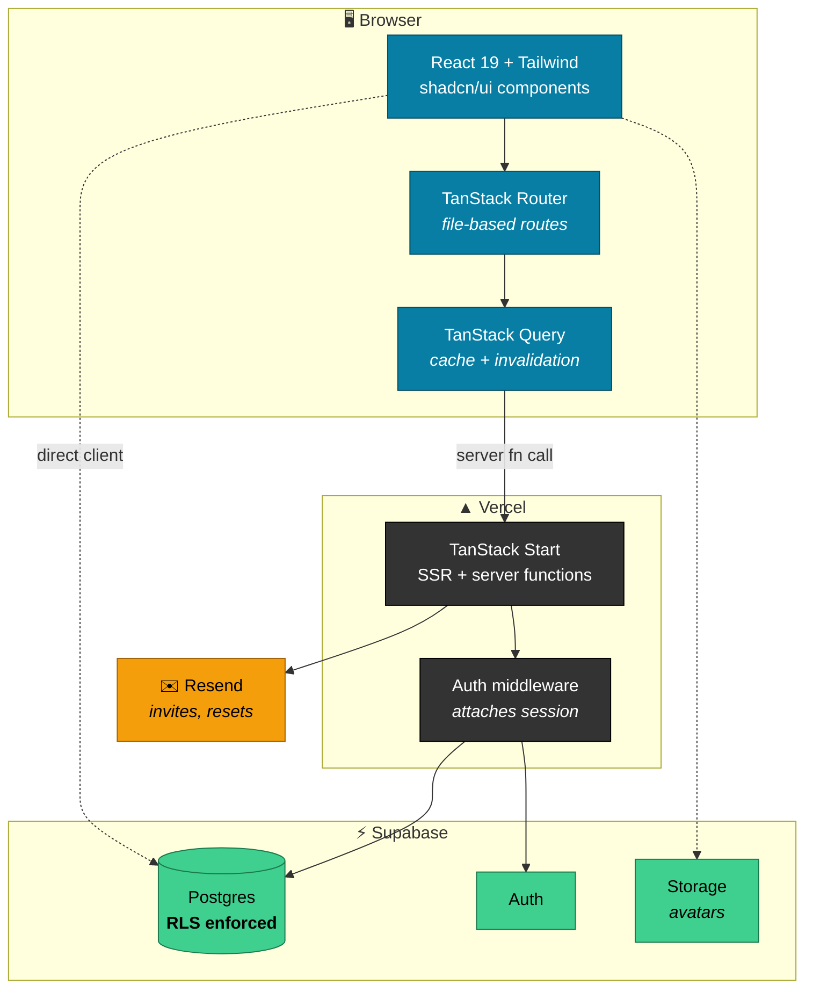
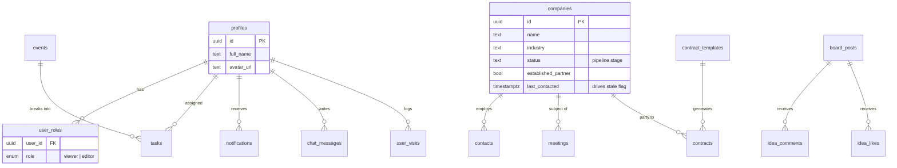

<div align="center">

# UUAIS Business Hub

**Outreach, contacts, meetings, events, tasks and contracts — one internal workspace.**

[](https://tanstack.com/start)
[](https://react.dev)
[](https://www.typescriptlang.org)
[](https://vite.dev)

[](https://supabase.com)
[](https://tailwindcss.com)
[](https://vercel.com)
[](https://github.com/Williyami/uuaibiz/actions/workflows/ci.yml)

</div>

---

## What it does

| | Module | Purpose |
|---|---|---|
| 🎯 | **Outreach** | Company pipeline as a kanban board or table, with industry and status tagging, and stale-deal flagging |
| 👥 | **Contacts** | People attached to companies, with titles and LinkedIn links |
| 📅 | **Meetings** | Internal and external meetings, with time, attendees and `.ics` export |
| 🗓️ | **Events** | Event planning with per-event checklists and grouped status filtering |
| ✅ | **Tasks** | Personal and shared task tracking with multiple assignees |
| 📄 | **Contracts** | Contract records generated from reusable templates, exportable to PDF |
| 💡 | **Ideas** | Idea board with likes and threaded comments |
| 💬 | **Chat** | Lightweight in-app team chat |
| 📊 | **Dashboard** | Cross-module overview with visit tracking |

---

## Architecture



> [!IMPORTANT]
> Authorization lives in **Postgres**, not the UI. Row-level security decides what
> each role can read and write — hiding a button is a convenience, never the control.

---

## Data model



**Roles**

| Role | Read | Write | Notes |
|---|:---:|:---:|---|
| `viewer` | ✅ | ❌ | Default for newly approved accounts |
| `editor` | ✅ | ✅ | Granted explicitly via `user_roles` |

New sign-ups land in `access_requests` and stay inert until approved.

---

## Quick start

> Requires **Node 20+**

```bash
npm install
cp .env.example .env        # fill in the values below
npm run dev                 # → http://localhost:5173
```

### Environment

`VITE_`-prefixed variables are **inlined into the client bundle** at build time.
Everything else is server-only.

| Variable | Scope | Purpose |
|---|:---:|---|
| `VITE_SUPABASE_URL` | 🌐 client | Supabase project URL |
| `VITE_SUPABASE_PUBLISHABLE_KEY` | 🌐 client | Anon key — public by design, safe only because RLS is on |
| `SUPABASE_SERVICE_ROLE_KEY` | 🔒 server | **Bypasses RLS entirely.** Never expose, never commit |
| `RESEND_API_KEY` | 🔒 server | Transactional email |
| `APP_URL` | 🔒 server | Base URL for links inside emails |

> [!WARNING]
> `SUPABASE_SERVICE_ROLE_KEY` is a master key — it ignores every RLS policy you have.
> If it ever lands in a commit, rotate it in the Supabase dashboard. Deleting the file
> is not enough; the key stays valid in every existing clone.

The app throws on boot when the Supabase URL or publishable key is missing, so a blank
`.env` fails loudly instead of silently rendering an empty shell.

---

## Scripts

| Command | Does |
|---|---|
| `npm run dev` | Dev server with HMR |
| `npm run build` | Production build |
| `npm run preview` | Serve the production build locally |
| `npm run lint` | ESLint |
| `npm run typecheck` | `tsc --noEmit` — Vite strips types, it doesn't check them |
| `npm run format` | Prettier, writes in place |

---

## Layout

```
src/
├── routes/
│   ├── _authenticated/      🔐 signed-in app — guarded by route.tsx
│   │   ├── dashboard.tsx        outreach · contacts · meetings
│   │   ├── events_.$eventId.tsx events · tasks · contracts
│   │   └── ideas.tsx            ideas · chat · team · settings
│   ├── auth.tsx             sign-in, reset, profile setup
│   └── __root.tsx           shell, providers, error boundary
├── components/
│   ├── outreach/            kanban, company table, stale badge
│   ├── events/  meetings/   feature dialogs
│   └── ui/                  shadcn primitives
├── lib/                     server functions, queries, formatting, ics, pdf
└── integrations/supabase/   client, auth middleware, generated types

supabase/migrations/         schema history — applied separately from deploys
```

> [!NOTE]
> `src/routeTree.gen.ts` is generated by the router plugin. Don't hand-edit it.

---

## Database changes

Schema lives in `supabase/migrations/`, applied with the Supabase CLI:

```bash
supabase db push
```

> [!CAUTION]
> Migrations **do not** run as part of the Vercel deploy. Push the migration *before*
> shipping code that depends on it, or production breaks in the window between the two.

---
